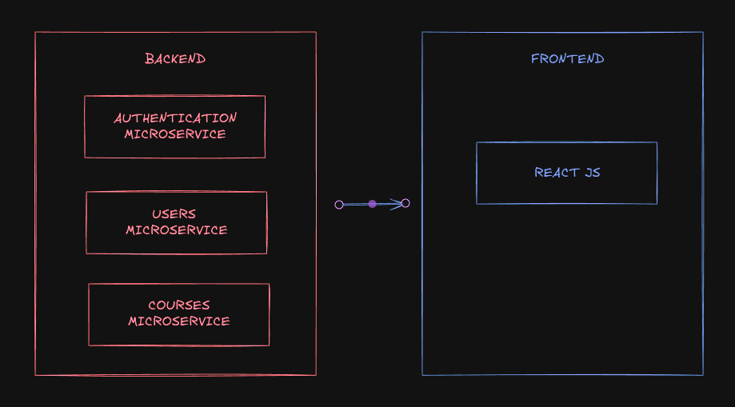

# Learning Management System

Plataforma de aprendizaje electrónico que conecta a administradores, profesores y estudiantes en un entorno colaborativo. Permite gestionar cursos, módulos, tareas y calificaciones, además de brindar herramientas de videoconferencia, foros de discusión y notificaciones en tiempo real. Su objetivo es ofrecer una experiencia educativa integral, flexible y accesible tanto desde la web como desde dispositivos móviles.

## Architecture
